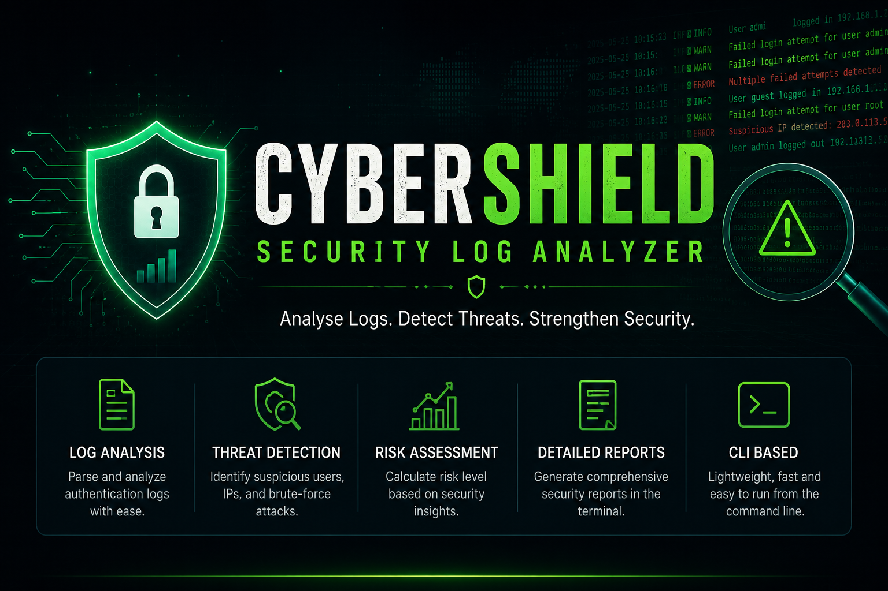

<p align="center">
  
</p>


# 🛡️ CyberShield Security Log Analyzer

A Java-based Security Log Analyzer that parses authentication logs, detects suspicious login activity, and generates structured security reports.

---

## 📖 Overview

CyberShield Security Log Analyzer is a Java application developed to simulate how Security Operations Center (SOC) analysts analyze authentication logs. The application reads log files, processes login events, detects suspicious behavior, and generates structured security reports.

This project was built to strengthen Java programming skills while applying fundamental cybersecurity concepts such as log analysis, threat detection, and security reporting.

---

## ✨ Features

- 📄 Read authentication logs from text files
- 🔍 Parse log entries into structured objects
- 📊 Generate login statistics
- 👤 Count unique users
- 🌐 Count unique IP addresses
- 🚨 Detect suspicious users based on repeated failed logins
- 🌍 Detect suspicious IP addresses
- 🎯 Identify the most targeted user
- 📍 Identify the most suspicious IP address
- 📈 Calculate overall security risk (Low / Medium / High)
- 🕒 Display first and last log timestamps
- 📋 Generate a structured security report

---

## 🛠️ Technologies Used

- Java
- Object-Oriented Programming (OOP)
- Java Collections Framework
  - ArrayList
  - HashMap
  - HashSet
- File Handling
- Exception Handling
- VS Code

---

## 📂 Project Structure

```
CyberShield-Security-Log-Analyzer
│
├── src
│   ├── model
│   ├── parser
│   ├── detector
│   ├── report
│   ├── util
│   └── App.java
│
├── sample_logs
│   └── logs.txt
│
└── README.md
```

---

## 🚀 How to Run

1. Clone the repository.

```bash
git clone https://github.com/prasoonkashyap18/CyberShield-Security-Log-Analyzer.git
```

2. Open the project in VS Code.

3. Ensure Java is installed.

4. Run `App.java`.

---

## 🎯 Learning Outcomes

Through this project, I gained practical experience with:

- Object-Oriented Programming
- Java Collections Framework
- File Parsing
- Data Analysis
- Security Log Analysis
- Threat Detection Logic
- Java Project Structure
- Report Generation

---

## 🔮 Future Improvements

- Real-time log monitoring
- Database integration
- Graphical User Interface (GUI)
- Search and filter functionality
- Export reports to PDF
- Dashboard with charts
- Email alert system
- Multi-threaded log processing

---

## 👨‍💻 Author

**Prasoon Kashyap**

GitHub: https://github.com/prasoonkashyap18

LinkedIn: www.linkedin.com/in/prasoon--kashyap

---

⭐ If you found this project interesting, consider giving it a star!
